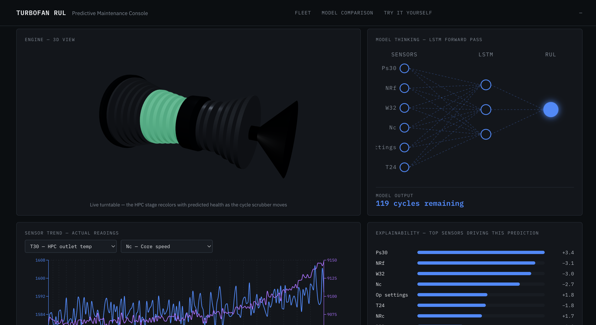

# Predictive Maintenance for Aircraft Engines — RUL Estimation on NASA C-MAPSS

Predicting the **remaining useful life (RUL)** of turbofan engines from sensor data, using the NASA C-MAPSS dataset, with a web dashboard to explore the trained models on real held-out test engines.



## The dataset

C-MAPSS has four sub-datasets of increasing difficulty. Each is a fleet of simulated engines with 21 sensor readings and 3 operational settings per flight cycle. Training engines run to failure; test engines are cut off mid-life, and the goal is to predict how many cycles they have left.

| Dataset | Operating conditions | Fault modes | Train / test engines |
|---|---|---|---|
| FD001 | 1 | 1 (HPC degradation) | 100 / 100 |
| FD002 | 6 | 1 | 260 / 259 |
| FD003 | 1 | 2 (HPC + fan degradation) | 100 / 100 |
| FD004 | 6 | 2 | 249 / 248 |

## What I did

- **Cleaning** (`data_cleaning/`): dropped sensors that are constant per dataset, added the RUL target to the training data (cycles until that engine's failure), capped at 125 cycles — standard for this dataset, since early-life RUL isn't meaningfully predictable.
- **Feature engineering** (`models/`), tailored per dataset:
  - 5-cycle rolling mean/std of every sensor.
  - **FD002/FD004** — the 6 operating conditions aren't labeled, so they're recovered with k-means on the operational settings, and each sensor is normalized *per regime* (the same raw reading means different things in different regimes).
  - **FD003/FD004** — the two fault modes aren't labeled either, so engines are clustered by their per-sensor degradation trends into an inferred fault mode, used as a feature.
  - Everything is fit on training engines only and refit inside every cross-validation fold to avoid leakage. Train/validation splits are by engine, never by row.
- **Models**: a tree model (Random Forest for FD001, tuned XGBoost for FD002–FD004) and an LSTM over a sliding window of cycles (window length tuned per dataset). Evaluated with a 5-fold engine-grouped cross-validation, then scored once on the official test set against the true RUL answer key.
- **Full results** (validation, CV folds, test set): [`results/results.md`](results/results.md).

### Test-set results (RMSE in cycles / R²)

| Dataset | Tree model | LSTM |
|---|---|---|
| FD001 | 18.12 / 0.796 (Random Forest) | 16.49 / 0.831 |
| FD002 | 16.57 / 0.851 (XGBoost) | 14.44 / 0.887 |
| FD003 | 20.06 / 0.738 (XGBoost) | 17.26 / 0.806 |
| FD004 | 19.16 / 0.801 (XGBoost) | 19.94 / 0.785 |

FD004 is the hardest sub-dataset in the literature (6 regimes and 2 fault modes at once), and the numbers reflect that.

## The app

A FastAPI backend serves the saved models; a React + Three.js frontend has four screens:

- **Fleet** — every real test engine, color-coded by its predicted RUL, with live test-set RMSE / R² / NASA score.
- **Engine detail** — scrub through an engine's actual sensor history; each step runs a real inference, recolors the 3D engine's HPC stage by predicted health, and shows per-cycle explainability (SHAP for the tree models, gradient saliency for the LSTM).
- **Model comparison** — test and validation metrics for every model, plus the cross-validation breakdown.
- **Try it yourself** — sensor sliders (real training-data ranges) or a CSV upload, run through the exact preprocessing used in training.

## Running it

Requires Python 3.12 and Node 18+.

```bash
# 1. Python environment
python3.12 -m venv .venv
source .venv/bin/activate
pip install -r requirements.txt

# 2. Train the models (saves to models/artifacts/ — not in the repo). ~30-40 min total, FD004 is the slow one.
python models/FD001_model.py
python models/FD002_model.py
python models/FD003_model.py
python models/FD004_model.py

# 3. Backend (from the project root)
uvicorn backend.main:app --port 8000

# 4. Frontend, in a second terminal
cd frontend
npm install --legacy-peer-deps
npm run dev
```

Then open http://localhost:5173. The backend takes ~30 s to start while it loads the models and scores the test sets.

To re-check a model on the official test set from the command line: `python evaluation/evaluate_FD001.py` (etc.).
